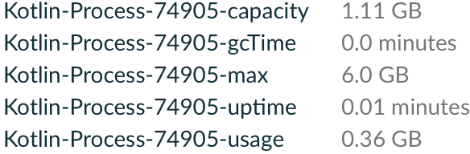

# Info Kotlin Process Plugin
Includes information about Kotlin processes in the Build Scans or in the build output.
The plugin is compatible with configuration cache.

## Usage
Apply the plugin in the main `build.gradle(.kts)` configuration file:

#### Kotlin
Using the plugins DSL:
``` groovy
plugins {
  id("io.github.cdsap.kotlinprocess") version "0.1.6"
}
```

Using legacy plugin application:
``` groovy
buildscript {
  repositories {
    gradlePluginPortal()
  }
  dependencies {
    classpath("io.github.cdsap:infokotlinprocess:0.1.6")
  }
}

apply(plugin = "io.github.cdsap.kotlinprocess")
```

#### Groovy
Using the plugins DSL:
``` groovy
plugins {
  id "io.github.cdsap.kotlinprocess" version "0.1.6"
}

```

Using legacy plugin application:
``` groovy
buildscript {
  repositories {
    gradlePluginPortal()
  }
  dependencies {
    classpath "io.github.cdsap:infokotlinprocess:0.1.6"
  }
}

apply plugin: "io.github.cdsap.kotlinprocess"
```
## Output
### Build Scans
If you are using Gradle Enterprise, the information about the Kotlin processes will be included as custom value in the
Build Scan:



### Build Output
If you are not using Gradle Enterprise, the information about the Kotlin processes will be included at the end of the build:
```
> Task :core:ui:compileProdDebugKotlin
┌─────────────────────────────────────────────────────────────────────────────┐
│  Kotlin processes                                                           │
├─────────┬──────────┬───────────┬────────────┬───────────────┬───────────────┤
│  PID    │  Max     │  Usage    │  Capacity  │  GC Time      │  Uptime       │
├─────────┼──────────┼───────────┼────────────┼───────────────┼───────────────┤
│  10865  │  1.0 Gb  │  0.66 Gb  │  1.0 Gb    │  0.0 minutes  │  0.0 minutes  │
├─────────┼──────────┼───────────┼────────────┼───────────────┼───────────────┤
│  9011   │  0.5 Gb  │  0.2 Gb   │  0.5 Gb    │  0.0 minutes  │  0.0 minutes  │
└─────────┴──────────┴───────────┴────────────┴───────────────┴───────────────┘
BUILD SUCCESSFUL in 35s

```


## Requirements
* Gradle 7.5

## Libraries
* `com.gradle:develocity-gradle-plugin`
* `com.gradle.enterprise:com.gradle.enterprise.gradle.plugin`
* `com.jakewharton.picnic:picnic`
